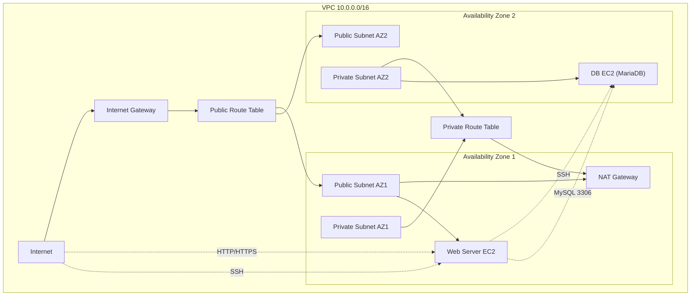

# AWS VPC Manual Build with CLI - Part 1 of 3
Next up: Infrastructure as Code (Terraform)

This is a demonstration of creating a Virtual Private Cloud (VPC) using the AWS Command Line Interface (AWS CLI). You'll learn how to set up a VPC with public and private subnets, configure internet connectivity, and deploy EC2 instances to demonstrate a common web application architecture. This project is part of a series of demos where we will progress from:

1 - Manual build using CLI

2 - Infrastructure as Code using Terraform

3 - Adding security and policy-as-code into the build process

While the main purpose of this 3 part series is to demonstrate a progression from manual to automated and more secure build processes, it is also kept minimal and serves as a deliberate return to AWS fundamentals for anyone who wants to learn or validate their understanding of basic AWS infrastructure components and dependencies.

The original steps were taken from AWS documentation at:
https://docs.aws.amazon.com/vpc/latest/userguide/getting-started-with-amazon-vpc-using-the-aws-cli.html

A few enhancements have been added here to include things like exporting resource values to environment variables for easy tracking and additional security group rules that were left out of the original AWS walkthrough to allow SSH functionality and using your local development environment's IP to ensure that access to resources is restricted.

What this project builds - a basic public web tier + private database tier architecture:

* One VPC with CIDR 10.0.0.0/16
* Two public subnets, one in each AZ
* Two private subnets, one in each AZ
* One Internet Gateway attached to the VPC
* One public route table associated to both public subnets, with default route to the IGW
* One private route table associated to both private subnets, with default route to a single NAT Gateway
* One NAT Gateway placed in only one public subnet
* One web EC2 instance in a public subnet
* One DB EC2 instance with MariaDB in a private subnet

## Architecture

## Production Considerations

For production environments, consider the following security and architecture best practices:

* NAT Gateway Design: This demo uses a single NAT Gateway in one AZ for simplicity and cost. In production, deploy one NAT Gateway per AZ to avoid cross-AZ traffic dependencies and single points of failure.

* Network ACLs: Implement Network ACLs as an additional layer of security beyond security groups.

* VPC Flow Logs: Enable VPC Flow Logs to monitor and analyze network traffic patterns.

* Resource Tagging: Implement a comprehensive tagging strategy for better resource management.