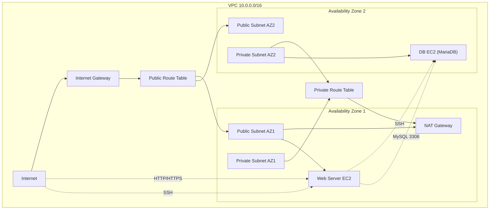

# AWS VPC Manual Build with CLI - Part 1 of 3
## Next: AWS VPC with Infrastructure as Code (Terraform)

This is a demonstration of creating a Virtual Private Cloud (VPC) using the AWS Command Line Interface (AWS CLI). You'll learn how to set up a VPC with public and private subnets, configure internet connectivity, and deploy EC2 instances to demonstrate a common web application architecture. This project is part of a series of demos where we will progress from:

1 - Manual build using CLI

2 - Infrastructure as Code using Terraform

3 - Adding security and policy-as-code into the build process

While the main purpose of this 3 part series is to demonstrate a progression from manual to automated and more secure build processes, it is intentionally kept minimal and serves as a deliberate return to AWS fundamentals for anyone who wants to learn or validate their understanding of basic AWS infrastructure components and dependencies.

The original steps were taken from AWS documentation at:
https://docs.aws.amazon.com/vpc/latest/userguide/getting-started-with-amazon-vpc-using-the-aws-cli.html

Enhancements include exporting resource values to environment variables for easier tracking, and adding security group rules (not included in the original AWS walkthrough) to allow SSH access restricted to your local IP.

What This Project Builds
A basic public web tier + private database tier architecture:

* One VPC with CIDR 10.0.0.0/16
* Two public subnets, one in each AZ
* Two private subnets, one in each AZ
* One Internet Gateway attached to the VPC
* One public route table associated to both public subnets, with default route to the IGW
* One private route table associated to both private subnets, with default route to a single NAT Gateway
* One NAT Gateway placed in only one public subnet
* One web EC2 instance in a public subnet
* One DB EC2 instance with MariaDB in a private subnet

## Session State Handling

To make the CLI workflow restartable and easier to follow, resource IDs are persisted to a local session.env file. This allows the demo to recover from interruptions (e.g., closed terminals) and reflects a more production-friendly scripting approach.

## Reporting
A script (infrastructure_report.sh) is provided to report all relevant resources in your AWS account. While it highlights what is created in this exercise, it will also surface any other existing resources so you have a complete view of what is currently running. This is especially useful for identifying forgotten or unintended resources that could incur charges.

If you're working in a personal or shared AWS account, it’s strongly recommended to configure billing alerts and budgets:
https://docs.aws.amazon.com/cost-management/latest/userguide/budgets-managing-costs.html

## Architecture

## Production Considerations

For production environments, consider the following security and architecture best practices:

* NAT Gateway Design: This demo uses a single NAT Gateway in one AZ for simplicity and cost. In production, deploy one NAT Gateway per AZ to avoid cross-AZ traffic dependencies and single points of failure.

* Network ACLs: Implement Network ACLs as an additional layer of security beyond security groups.

* VPC Flow Logs: Enable VPC Flow Logs to monitor and analyze network traffic patterns.

* Resource Tagging: Implement a comprehensive tagging strategy for better resource management.

## List of AWS CLI Commands Used in This Project
Even a basic VPC setup requires ~40 discrete API operations. This is where Infrastructure as Code helps reduce complexity, enforce consistency, and prevent configuration drift. Be sure to check out demo 2 - AWS Basic Infrastructure with Terraform.

- aws configure list
- aws sts get-caller-identity
- aws ec2 create-vpc
- aws ec2 modify-vpc-attribute
- aws ec2 describe-availability-zones
- aws ec2 create-subnet
- aws ec2 create-internet-gateway
- aws ec2 attach-internet-gateway
- aws ec2 create-route-table
- aws ec2 create-route
- aws ec2 associate-route-table
- aws ec2 allocate-address
- aws ec2 create-nat-gateway
- aws ec2 wait nat-gateway-available
- aws ec2 modify-subnet-attribute
- aws ec2 create-security-group
- aws ec2 authorize-security-group-ingress
- aws ec2 describe-vpcs
- aws ec2 describe-subnets
- aws ec2 describe-route-tables
- aws ec2 describe-internet-gateways
- aws ec2 describe-nat-gateways
- aws ec2 describe-security-groups
- aws ec2 create-key-pair
- aws ec2 describe-images
- aws ec2 run-instances
- aws ec2 describe-instances
- aws ec2 terminate-instances
- aws ec2 wait instance-terminated
- aws ec2 delete-key-pair
- aws ec2 delete-nat-gateway
- aws ec2 wait nat-gateway-deleted
- aws ec2 release-address
- aws ec2 delete-security-group
- aws ec2 disassociate-route-table
- aws ec2 delete-route-table
- aws ec2 detach-internet-gateway
- aws ec2 delete-internet-gateway
- aws ec2 delete-subnet
- aws ec2 delete-vpc